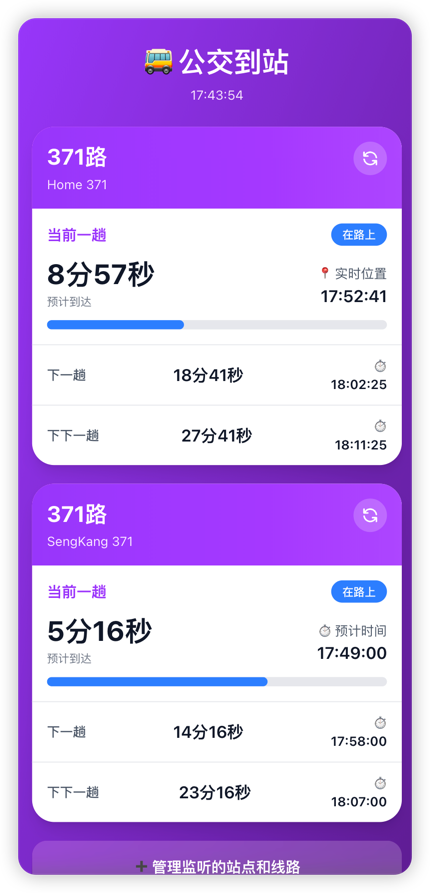

# 🚌 公交到站提醒系统

一个基于 Next.js 的实时公交到站提醒应用，支持监控新加坡公交系统的实时到站信息。

## ✨ 功能特点

- 📍 **实时监控**: 实时获取公交到站信息，每5秒自动更新
- 🔄 **单独刷新**: 每个站点卡片右上角有刷新按钮，可单独刷新该站点（保持顺序）
- 🔢 **自定义排序**: 通过上下箭头按钮调整站点显示顺序
- 🎁 **默认站点**: 首次使用自动添加两个示例站点
- 🎯 **多站点支持**: 同时监控多个公交站点
- 🚌 **线路筛选**: 为每个站点选择要监控的特定公交线路
- 💾 **本地存储**: 所有配置保存在浏览器本地，无需服务器
- 🎨 **美观界面**: 参考原型设计，提供现代化的用户界面
- 📱 **响应式设计**: 完美支持移动端和桌面端
- ⚡ **状态提示**: 智能显示"即将到站"、"快到了"、"在路上"等状态
- 📊 **进度条显示**: 直观展示公交到站进度

## 🚀 快速开始

### 安装依赖

```bash
npm install
```

### 运行开发服务器

```bash
npm run dev
```

打开浏览器访问 [http://localhost:3000](http://localhost:3000)

### 构建生产版本

```bash
npm run build
npm start
```

## 📖 使用说明

### 1. 添加监控站点

1. 点击主页的 "管理监听的站点和线路" 按钮
2. 点击 "添加新站点"
3. 填写以下信息：
   - **站点名称**: 自定义的站点名称（如: 深圳湾公园站）
   - **站点代码**: 公交站点代码（如: 67661）
   - **监听线路**: 要监控的公交线路号，多个线路用逗号分隔（如: 371, 5, 14）
4. 点击 "添加" 保存

### 2. 查看实时到站信息

- 返回主页即可看到所有监控站点的实时公交信息
- 每趟公交显示三个时段：当前一趟、下一趟、下下一趟
- 状态标识：
  - 🔴 **即将到站**: 1分钟内到达
  - 🟠 **快到了**: 1-3分钟内到达
  - 🔵 **在路上**: 3分钟以上
- 📍 实时位置 / ⏱️ 预计时间 标识
- 🔄 **刷新按钮**: 点击站点卡片右上角的刷新按钮可立即更新该站点数据

### 3. 管理站点

在管理页面可以：
- ✏️ **编辑**: 修改站点信息
- 🗑️ **删除**: 删除不需要的站点
- ↕️ **排序**: 使用上下箭头按钮调整站点显示顺序

### 4. 默认站点

首次使用时，系统会自动添加两个示例站点：
- **Home 371** (站点代码: 67661, 线路: 371)
- **SengKang 371** (站点代码: 67009, 线路: 371)

不需要时可以随时删除，删除后不会再自动添加。

## 🛠️ 技术栈

- **Framework**: Next.js 15 (App Router)
- **Language**: TypeScript
- **Styling**: Tailwind CSS
- **Data Source**: [ArriveLah2 API](https://arrivelah2.busrouter.sg/)
- **Storage**: LocalStorage (浏览器本地存储)

## 📁 项目结构

```
src/
├── app/
│   ├── api/
│   │   └── bus-arrival/      # API 路由：代理公交到站数据
│   ├── manage/                # 站点管理页面
│   ├── page.tsx               # 主页：显示实时到站信息
│   ├── layout.tsx             # 全局布局
│   └── globals.css            # 全局样式
├── types/
│   └── bus.ts                 # TypeScript 类型定义
└── utils/
    ├── busApi.ts              # 公交 API 工具函数
    └── localStorage.ts        # 本地存储工具函数
```

## 🔌 API 说明

### 获取公交到站数据

```typescript
GET /api/bus-arrival?code={站点代码}
```

返回格式：
```json
{
  "services": [
    {
      "no": "371",
      "operator": "SBST",
      "next": {
        "duration_ms": 77569,
        "time": "2025-10-19T15:06:54+08:00",
        "monitored": 1
      },
      "next2": { ... },
      "next3": { ... }
    }
  ]
}
```

### 跨域处理

本项目通过 **Next.js API Routes 服务端代理** 完美解决了跨域问题：

- ✅ 前端调用 `/api/bus-arrival`（同域请求，无 CORS 限制）
- ✅ 服务端代理请求外部 API `https://arrivelah2.busrouter.sg/`
- ✅ 三层防护：API Route + Next.js Config + Middleware
- ✅ 支持 OPTIONS 预检请求
- ✅ 生产环境和开发环境表现一致

详细说明请参考：[跨域解决方案文档](./docs/CORS_SOLUTION.md)

## 💡 数据字段说明

- `code`: 公交站点代码（5位数字）
- `bus`: 公交线路号（如: "371"）
- `duration_ms`: 到站时间（毫秒）
- `monitored`: 是否有实时位置（1=有，0=预计）

## 📱 界面预览



- **主页**: 展示所有监控站点的实时公交信息
- **管理页**: 添加、编辑、删除监控站点

## 🎨 设计特点

- 渐变紫色主题背景
- 毛玻璃效果卡片
- 平滑过渡动画
- 状态颜色编码
- 响应式布局

## 🔄 自动更新

- 当前时间：每秒更新
- 公交数据：每5秒自动更新
- 手动刷新：点击站点卡片右上角的刷新按钮可立即更新（保持站点顺序）
- 本地倒计时：每秒递减

## 📝 开发说明

本项目使用 Next.js 15 的最新特性：
- App Router
- Server Components
- API Routes
- TypeScript

所有公交数据通过服务端 API 路由代理，避免 CORS 问题。

## ☁️ 部署

### Cloudflare Pages（推荐）

本应用已针对 Cloudflare Pages 优化，支持开箱即用：

```bash
# 1. 推送到 GitHub
git push origin main

# 2. 在 Cloudflare Pages 连接仓库
# 3. 选择 Framework: Next.js (SSR)
# 4. 点击部署
```

**详细指南**：
- [快速部署](docs/DEPLOY_CF_QUICK.md) - 1分钟快速部署
- [完整指南](docs/CLOUDFLARE_DEPLOYMENT.md) - 详细的部署和优化

### 跨域问题

✅ **已通过 Next.js API Routes 解决**
- 无需额外配置
- 自动处理 CORS
- 支持所有部署平台

### 其他平台

- **Vercel**: 推送到 GitHub，自动部署
- **Netlify**: 选择 Next.js 框架，自动配置
- **自托管**: `npm run build && npm start`

## 📄 许可证

MIT

---

Made with ❤️ for commuters
