# ☁️ Cloudflare Pages 部署指南

## 跨域问题处理方案

在 Cloudflare Pages 上部署 Next.js 应用时，处理跨域问题有以下几种方案：

---

## 方案对比

| 方案 | 难度 | 效果 | 推荐度 |
|------|------|------|--------|
| **Next.js API Routes** | ⭐ 简单 | ✅ 完美 | ⭐⭐⭐⭐⭐ |
| **Cloudflare Workers** | ⭐⭐ 中等 | ✅ 完美 | ⭐⭐⭐⭐ |
| **_headers 文件** | ⭐ 简单 | ⚠️ 有限 | ⭐⭐ |
| **_redirects 文件** | ⭐⭐ 中等 | ✅ 较好 | ⭐⭐⭐ |

---

## 🎯 方案 1: Next.js API Routes (推荐) ⭐⭐⭐⭐⭐

### 当前实现

**我们的应用已经使用了这个方案！** 这是最佳实践。

```typescript
// src/app/api/bus-arrival/route.ts
export async function GET(request: NextRequest) {
  const code = searchParams.get('code');
  
  // 服务端代理请求
  const response = await fetch(
    `https://arrivelah2.busrouter.sg/?id=${code}`,
    { cache: 'no-store' }
  );
  
  const data = await response.json();
  
  // 返回数据（带 CORS headers）
  return NextResponse.json(data, {
    headers: {
      'Access-Control-Allow-Origin': '*',
      'Cache-Control': 'no-store',
    },
  });
}
```

### 工作原理

```
浏览器 → /api/bus-arrival (同域) → CF Pages (Next.js) → 外部 API
         ✅ 无 CORS 问题            ✅ 服务端请求        ✅ 正常返回
```

### 优点
- ✅ **已经实现**: 代码不需要修改
- ✅ **完全解决**: 彻底避免 CORS 问题
- ✅ **统一处理**: 可以添加认证、缓存、日志
- ✅ **部署简单**: Cloudflare Pages 原生支持 Next.js

### 部署到 Cloudflare Pages

#### 步骤 1: 构建配置

确保 `package.json` 有正确的构建命令：

```json
{
  "scripts": {
    "build": "next build",
    "start": "next start"
  }
}
```

#### 步骤 2: Cloudflare Pages 设置

在 Cloudflare Pages 项目设置中：

```yaml
Build command: npm run build
Build output directory: .next
Framework preset: Next.js
Node version: 18 或更高
```

#### 步骤 3: 环境变量（可选）

如果需要配置环境变量：

```
NEXT_PUBLIC_API_BASE_URL=https://your-domain.pages.dev
```

### 验证部署

部署后访问：
```
https://your-app.pages.dev/api/bus-arrival?code=67661
```

应该返回 JSON 数据，无 CORS 错误。

---

## 🔧 方案 2: Cloudflare Workers (高级)

如果 Next.js API Routes 不够用，可以使用 Cloudflare Workers。

### 创建 Worker

```javascript
// worker.js
export default {
  async fetch(request) {
    // 处理 CORS 预检
    if (request.method === 'OPTIONS') {
      return new Response(null, {
        headers: {
          'Access-Control-Allow-Origin': '*',
          'Access-Control-Allow-Methods': 'GET, OPTIONS',
          'Access-Control-Allow-Headers': '*',
        },
      });
    }

    // 解析请求
    const url = new URL(request.url);
    const code = url.searchParams.get('code');

    if (!code) {
      return new Response('Missing code', { status: 400 });
    }

    try {
      // 代理请求
      const response = await fetch(
        `https://arrivelah2.busrouter.sg/?id=${code}`,
        {
          headers: {
            'Accept': 'application/json',
          },
        }
      );

      const data = await response.json();

      // 返回响应（带 CORS）
      return new Response(JSON.stringify(data), {
        headers: {
          'Content-Type': 'application/json',
          'Access-Control-Allow-Origin': '*',
          'Cache-Control': 'no-store',
        },
      });
    } catch (error) {
      return new Response(JSON.stringify({ error: error.message }), {
        status: 500,
        headers: {
          'Content-Type': 'application/json',
          'Access-Control-Allow-Origin': '*',
        },
      });
    }
  },
};
```

### 部署 Worker

```bash
# 安装 Wrangler
npm install -g wrangler

# 登录
wrangler login

# 部署
wrangler publish worker.js --name bus-api-proxy
```

### 使用 Worker

```typescript
// 修改 busApi.ts
const API_URL = 'https://bus-api-proxy.your-username.workers.dev';

export async function fetchBusArrivals(stopCode: string) {
  const response = await fetch(`${API_URL}?code=${stopCode}`);
  return await response.json();
}
```

### 优点
- ✅ 独立部署，不依赖 Next.js
- ✅ 全球边缘节点，速度快
- ✅ 免费额度充足（每天 10万 请求）

### 缺点
- ❌ 需要额外部署步骤
- ❌ 需要管理两个项目

---

## 📄 方案 3: _headers 文件

### 创建配置文件

在 `public` 目录创建 `_headers` 文件：

```
# public/_headers

/api/*
  Access-Control-Allow-Origin: *
  Access-Control-Allow-Methods: GET, POST, OPTIONS
  Access-Control-Allow-Headers: Content-Type
  Access-Control-Max-Age: 86400

/*
  X-Frame-Options: DENY
  X-Content-Type-Options: nosniff
  Referrer-Policy: strict-origin-when-cross-origin
```

### 限制
- ⚠️ **只能添加响应头**，不能代理请求
- ⚠️ **无法解决真正的跨域**（浏览器仍会阻止）
- ⚠️ 只适合配置安全头

### 适用场景
- 配置安全策略
- 设置缓存策略
- 但**不能解决 API 跨域**

---

## 🔀 方案 4: _redirects 文件

### 创建配置文件

在 `public` 目录创建 `_redirects` 文件：

```
# public/_redirects

# 代理 API 请求
/api/external/* https://arrivelah2.busrouter.sg/:splat 200
```

### 使用方式

```typescript
// 前端直接调用代理路径
fetch('/api/external/?id=67661')
```

### 优点
- ✅ 简单配置即可
- ✅ 无需编写代码

### 缺点
- ⚠️ 功能有限，无法处理复杂逻辑
- ⚠️ 无法添加自定义 headers
- ⚠️ 无法处理错误
- ⚠️ Cloudflare Pages 对此支持有限

---

## 🎯 推荐方案总结

### 对于本项目

**继续使用 Next.js API Routes**（当前方案）✅

**为什么？**
1. ✅ 已经实现，代码完善
2. ✅ Cloudflare Pages 完全支持
3. ✅ 可以添加更多功能（缓存、限流、日志）
4. ✅ 部署简单，无需额外配置

### 部署检查清单

在部署到 Cloudflare Pages 前，确认：

- [x] ✅ API Routes 已实现（`/src/app/api/bus-arrival/route.ts`）
- [x] ✅ CORS headers 已配置
- [x] ✅ Middleware 已设置
- [x] ✅ `next.config.ts` 配置正确
- [ ] 📝 设置 Cloudflare Pages 项目
- [ ] 📝 配置构建命令
- [ ] 📝 部署并测试

---

## 📋 Cloudflare Pages 部署步骤

### 方法 1: 通过 Git 集成（推荐）

#### 1. 推送代码到 GitHub

```bash
git add .
git commit -m "Ready for Cloudflare Pages deployment"
git push origin main
```

#### 2. 连接到 Cloudflare Pages

1. 登录 [Cloudflare Dashboard](https://dash.cloudflare.com)
2. 进入 **Pages**
3. 点击 **Create a project**
4. 连接 GitHub 仓库
5. 选择您的项目

#### 3. 配置构建设置

```yaml
Framework preset: Next.js (Server-side Rendering)
Build command: npm run build
Build output directory: .next
Root directory: /
Node version: 18

Environment variables:
  NODE_VERSION: 18
```

#### 4. 部署

点击 **Save and Deploy**，等待构建完成。

---

### 方法 2: 通过 Wrangler CLI

#### 1. 安装 Wrangler

```bash
npm install -g wrangler
```

#### 2. 登录

```bash
wrangler login
```

#### 3. 创建项目

```bash
# 在项目根目录
wrangler pages project create bus-comming
```

#### 4. 部署

```bash
# 构建
npm run build

# 部署
wrangler pages deploy .next
```

---

## 🔍 部署后验证

### 1. 测试 API

访问您的部署域名：
```
https://bus-comming.pages.dev/api/bus-arrival?code=67661
```

**预期结果**:
- ✅ 返回 JSON 数据
- ✅ 无 CORS 错误
- ✅ 响应时间 < 1秒

### 2. 测试主页

访问：
```
https://bus-comming.pages.dev
```

**检查项**:
- ✅ 页面正常显示
- ✅ 默认站点加载
- ✅ 刷新按钮工作
- ✅ 数据实时更新

### 3. 检查 Console

打开浏览器开发者工具：
- ✅ 无 CORS 错误
- ✅ API 请求成功
- ✅ 日志正常输出

---

## ⚠️ 常见问题

### Q1: 部署后 API Routes 404？

**可能原因**:
- Framework preset 设置错误
- 选择了 Static Site 而不是 SSR

**解决方案**:
1. 在 Cloudflare Pages 设置中
2. 选择 **Framework preset: Next.js (SSR)**
3. 不要选择 Static Site

---

### Q2: CORS 错误仍然存在？

**检查**:
1. API Routes 是否正确部署
2. CORS headers 是否正确设置
3. Middleware 是否生效

**调试**:
```bash
# 测试 API
curl -I https://your-app.pages.dev/api/bus-arrival?code=67661

# 应该看到
Access-Control-Allow-Origin: *
```

---

### Q3: 构建失败？

**常见原因**:
- Node 版本不匹配
- 依赖安装失败
- 构建命令错误

**解决方案**:
```yaml
# 设置环境变量
NODE_VERSION: 18

# 确保 package.json 正确
"engines": {
  "node": ">=18.0.0"
}
```

---

### Q4: API 响应慢？

**优化方案**:

#### 1. 启用缓存

```typescript
// src/app/api/bus-arrival/route.ts
return NextResponse.json(data, {
  headers: {
    'Cache-Control': 'public, max-age=5, s-maxage=5',
  },
});
```

#### 2. 使用 Cloudflare KV 缓存

```typescript
// 高级用法
const cached = await env.KV.get(`bus:${code}`);
if (cached) return cached;

// 获取新数据
const data = await fetchFromAPI();
await env.KV.put(`bus:${code}`, data, { expirationTtl: 5 });
```

---

## 🚀 性能优化

### 1. 启用 Cloudflare 加速

Cloudflare Pages 自动提供：
- ✅ 全球 CDN
- ✅ 自动压缩
- ✅ HTTP/3 支持
- ✅ Brotli 压缩

### 2. 配置缓存策略

```typescript
// next.config.ts
const nextConfig = {
  async headers() {
    return [
      {
        source: '/api/:path*',
        headers: [
          { key: 'Cache-Control', value: 'public, max-age=5' },
        ],
      },
      {
        source: '/:path*',
        headers: [
          { key: 'Cache-Control', value: 'public, max-age=3600' },
        ],
      },
    ];
  },
};
```

### 3. 图片优化

```typescript
// next.config.ts
images: {
  formats: ['image/avif', 'image/webp'],
  deviceSizes: [640, 750, 828, 1080, 1200],
},
```

---

## 📊 监控和日志

### 1. Cloudflare Analytics

在 Pages 项目中查看：
- 请求数量
- 响应时间
- 错误率
- 流量来源

### 2. Real User Monitoring (RUM)

```typescript
// src/app/layout.tsx
import { Analytics } from '@cloudflare/pages-plugin-analytics';

export default function RootLayout({ children }) {
  return (
    <html>
      <body>
        {children}
        <Analytics token="your-token" />
      </body>
    </html>
  );
}
```

---

## 💰 成本估算

### Cloudflare Pages 免费版

- ✅ **无限请求**
- ✅ **无限带宽**
- ✅ **500 次构建/月**
- ✅ **1 次并发构建**
- ✅ **自动 SSL**
- ✅ **全球 CDN**

### 对于本项目

**完全免费！** ✅

预估使用量：
- 每天 1000 用户
- 每用户 50 次 API 请求
- 总计：50,000 请求/天
- **远低于免费额度** ✅

---

## 🎯 总结

### 最佳实践

1. ✅ **使用 Next.js API Routes**（已实现）
2. ✅ **部署到 Cloudflare Pages**（推荐）
3. ✅ **启用缓存策略**（提升性能）
4. ✅ **监控和日志**（发现问题）

### 部署流程

```mermaid
graph LR
    A[推送代码到 GitHub] --> B[连接 Cloudflare Pages]
    B --> C[配置构建设置]
    C --> D[自动部署]
    D --> E[访问域名测试]
```



### 你的应用已经准备好了！

- ✅ CORS 问题已解决
- ✅ API Routes 已实现
- ✅ 代码可直接部署
- ✅ 无需额外配置

**直接推送到 GitHub，连接 Cloudflare Pages 即可！** 🚀

